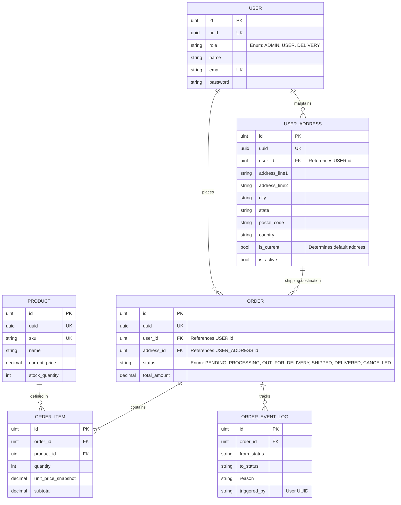

# Finalized Entity Relationship Diagram (ERD) - v3 (Enum RBAC & Addresses)

This diagram represents the production-ready schema including Enum-based Role-Based Access Control (RBAC) and User Address management.

## Entity Details

### 1. User (Updated)
- **role**: Implemented as an enum (text in DB) for simplicity and performance. Valid values: `ADMIN`, `USER`, `DELIVERY`.

### 2. User Address
- **is_current**: Only one address per user can be marked as current. This is managed atomically in the Repository layer.

### 3. Order
- **address_id**: Atomic link to the specific address at the time of order.
- **status**: Managed via role-based transition rules in the Service layer.

### 4. Atomic Integrity (Architectural Input)
- **Stock Movements**: Handled within DB transactions during `CreateOrder` (Deduction) and `CancelOrder`/`Status Update to CANCELLED` (Replenishment).
