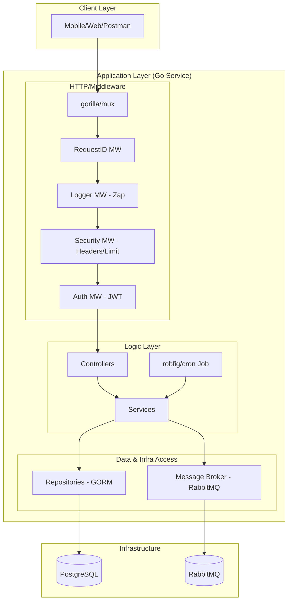
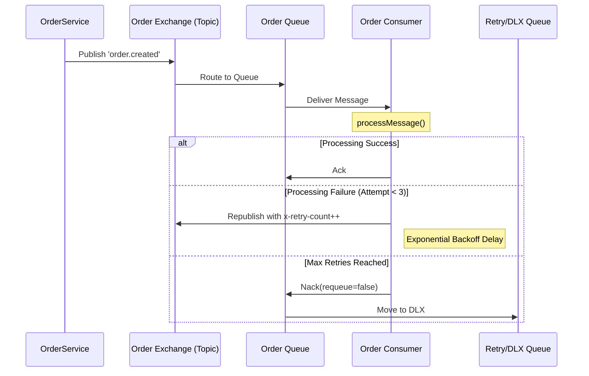

# System Architecture

The Order Processing System follows a strict N-tier, interface-driven architecture in Go, emphasizing separation of concerns, observability, and asynchronous reliability.

## 1. High-Level Component Diagram

## 2. Layer Responsibilities

### Controller Layer
- Handles HTTP request parsing using `DecodeAndValidate`.
- Maps incoming data to DTOs.
- Calls the appropriate Service method.
- Formats standardized Spenza-style responses (`ApiResponse`).

### Service Layer (Business Logic)
- **Identity Resolution:** Maps external UUIDs to internal PKs.
- **Validation:** Enforces business rules (e.g., "Only PENDING orders can be cancelled").
- **Orchestration:** Coordinates between Repositories and the Message Broker.
- **Asynchronous Flow:** Publishes events to RabbitMQ after critical state changes.

### Repository Layer (Data Access)
- Encapsulates GORM operations.
- Performs database lookups and persistence.
- Maps database-specific errors to custom domain `AppError` types.

### Infrastructure Layer
- **PostgreSQL:** Primary relational storage with optimized indexing.
- **RabbitMQ:** Handles post-creation activities with a robust **Retry & DLX** mechanism.
- **Cron Worker:** Operates as a background goroutine to transition order statuses automatically.

## 3. Asynchronous Event & Retry Flow

## 4. Security & Observability
- **Tracing:** Every request is assigned a `RequestID`, which is propagated through the `context.Context` and included in every log line.
- **Logging:** Structured logging via `uber-go/zap` ensures all Start/End/Error events are searchable and actionable.
- **Authentication:** Stateless JWT flow where the token holds the UUID, and the middleware verifies the user against the database.
